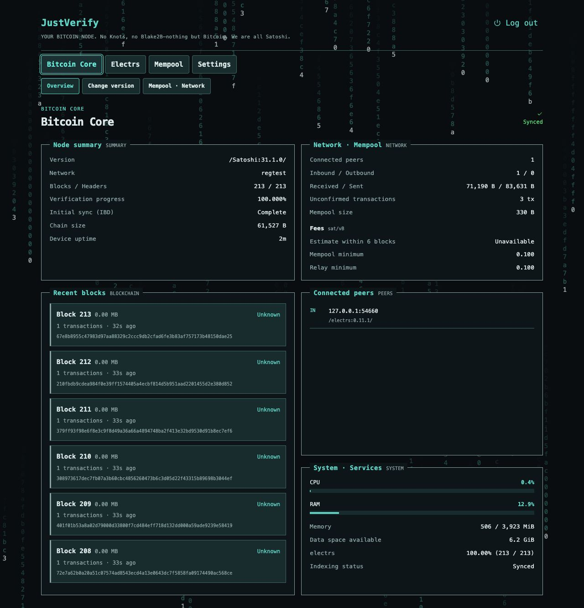
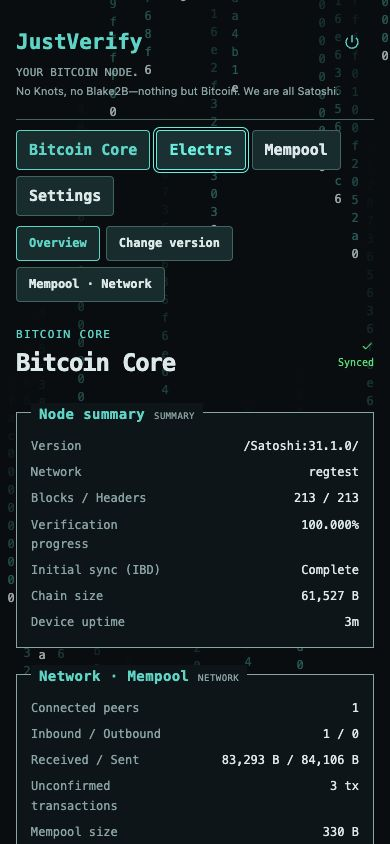
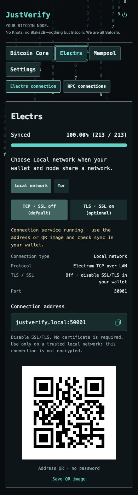
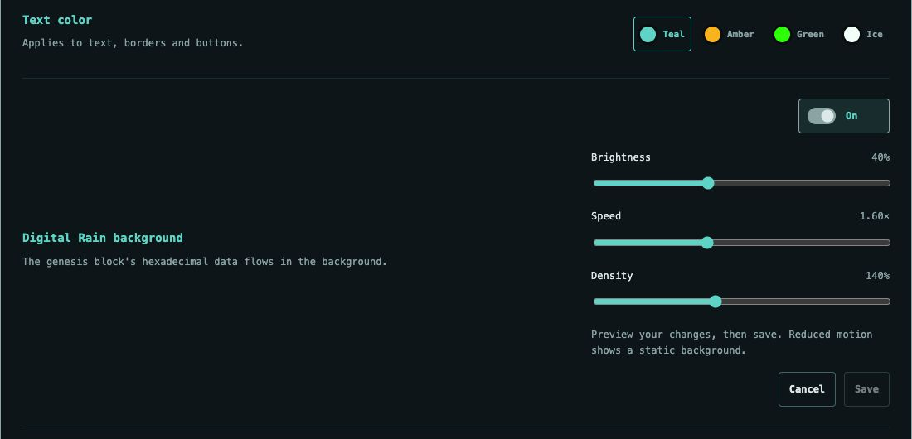

<h1 align="center">JustVerify</h1>

YOUR BITCOIN NODE. No Knots, no Blake2B—nothing but Bitcoin. We are all Satoshi.

Bitcoin Core·electrs·Tor·로컬 Mempool 탐색기를 함께 제공하는 Raspberry Pi 노드입니다. `justverify.local` 또는 실제 텍스트 인터페이스에서 관리합니다.

[English](../../README.md) · [日本語](../ja/README.md) · [소스로 이미지 만들기](BUILD.md)

## 정식 버전 0.1.2 다운로드

[Pi 이미지 IMG.XZ](https://github.com/dontrustjustverify/justverify/releases/download/v0.1.2/justverify-0.1.2.img.xz) · [SHA256SUMS](https://github.com/dontrustjustverify/justverify/releases/download/v0.1.2/justverify-0.1.2-SHA256SUMS) · [서명](https://github.com/dontrustjustverify/justverify/releases/download/v0.1.2/justverify-0.1.2-SHA256SUMS.asc) · [공개 서명키](https://github.com/dontrustjustverify/justverify/releases/download/v0.1.2/justverify-signing-key.asc) · [소스](https://github.com/dontrustjustverify/justverify/releases/download/v0.1.2/justverify-0.1.2-source.tar.gz) · [릴리스](https://github.com/dontrustjustverify/justverify/releases/tag/v0.1.2)

## 설치

기준 장비는 Raspberry Pi5, RAM8GB,2TB SSD/NVMe, 유선 LAN과 적절한 전원·냉각입니다. Pi4·x86용 이미지는 아닙니다.

1. 이미지와 체크섬·서명을 내려받고 [설치 안내](../INSTALL.md)에 따라 검증합니다.
2. XZ를 풀어 나온 `.img`를 balenaEtcher에서 선택합니다. **선택한 디스크의 모든 데이터가 삭제됩니다.** 기록 후 검증을 생략하지 마세요.
3. 저장장치를 Pi에 연결하고 부팅한 뒤 같은 LAN에서 `http://justverify.local/`을 열어 웹 관리자 암호를 설정합니다.
4. Core IBD, Electrs 인덱싱·DB 정리·최신 블록 확인 완료를 기다립니다. 멤풀의 Core 기반 블록 화면은 Electrs 인덱싱 중에도 사용할 수 있습니다.

지갑 앱에는 신뢰하는 LAN에서 **`justverify.local:50001`, SSL/TLS 끄기**를 사용하세요. 선택 TLS는50002이며 Tor 주소·QR은 Electrs 메뉴에 있습니다. [지갑 연결](../MOBILE_CONNECTIONS.md)을 참고하세요.

최초 SSH 계정·암호는 `justverify` / `justverify`입니다. 접속 후 `passwd`로 변경하세요. 웹 암호와 별개이며 SSH 암호로 sudo 인증을 합니다. [SSH 관리](../SSH.md).

## 기능

- 블록·피어·수수료·서비스 상태, Electrs 블록 인덱싱/DB 정리/최신 블록 반영/완료 표시.
- 공식 서명 검증을 거친 Core22.x–31.1 버전 선택과 버전별 정책 설정. 다른 버전으로 실제 전환하면 사전 검사와 삭제 범위 확인 후 같은 데이터 경로의 체인·인덱스를 초기화하고 전체 재동기화합니다. 단순 선택·다운로드는 데이터를 바꾸지 않습니다.
- Clearnet·Tor·I2P 피어 선택, 선택형 Tor 원격 웹 접속.
- 7일 로그인 유지·사용 중 연장, 접속 브라우저 관리·개별/다른 기기 로그아웃, 암호화 설정 백업.
- 한국어·영어·일본어 및 자동 브라우저 언어,4개 색상 테마.
- **설정 → Digital Rain 배경**: 새 설치에서는 꺼짐. 밝기 기본40%/최대100%, 속도 기본1.60×/최대4.00×, 밀도 기본140%/최대300%. 미리보기 후 저장/취소하며 기존 저장값을 유지합니다. 브라우저에서만 실행하고 숨겨진 탭에서는 멈춥니다.

Core31.1·electrs0.11.1·Mempool3.3.1·i2pd2.61.0을 고정합니다. 기본 노드는 지갑 개인키를 보관하지 않습니다. 재기록은 기존 데이터를 보존하는 업데이트가 아닙니다.

[노드 설정](../SETTINGS.md) · [복구](../RECOVERY.md) · [검증 범위](../TESTING.md) · [변경 내용](../RELEASE_NOTES.md) · [제3자 고지](../../licenses/THIRD_PARTY_NOTICES.md)

릴리스에는 실제 실행한 시험과 미검증 실물 지갑·장비 조합을 구분한 검증 보고서가 포함됩니다.

## 화면과 영상

Digital Rain을 켠 0.1.0 화면입니다. 독립된 regtest 노드에서 촬영했으며 모바일 화면은 390 px 브라우저 기준입니다.

**데스크톱 현황**

**모바일 현황 및 Electrs 지갑 연결**

 

**Digital Rain 설정**

**30초 둘러보기 · 10개 화면을 각 3초씩**

https://github.com/user-attachments/assets/d26903d9-03a6-45cb-b740-3a5e81ee8407

[MP4 다운로드](https://github.com/dontrustjustverify/justverify/releases/download/v0.1.0/justverify-0.1.0-tour.mp4)
